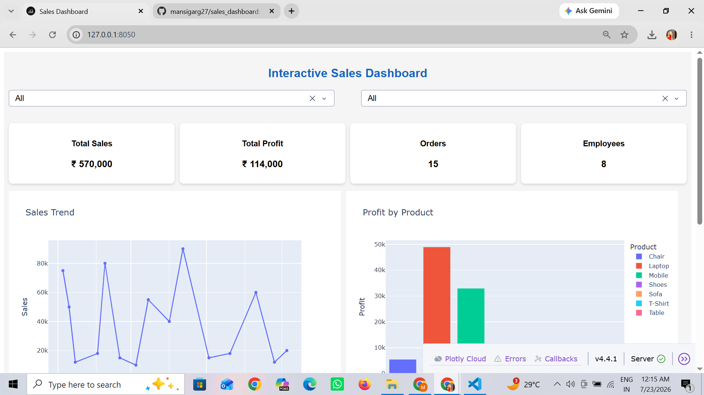
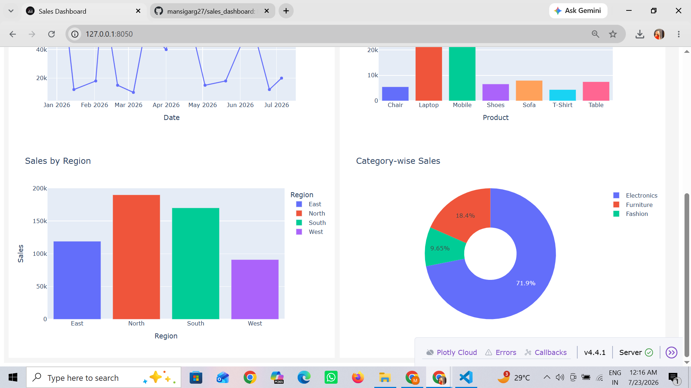

# sales_dashboard
## Project Overview
This project is an interactive sales dashboard developed using Python and Dash. It helps visualize company sales data and provides interactive filtering options for better decision-making.

## Technologies Used
- Python
- Dash
- Plotly
- Pandas
- SQLite

## Features
- Interactive Dashboard
- Region Filter
- Category Filter
- KPI Cards
- Sales Trend Chart
- Sales by Region
- Category-wise Sales
- Profit by Product
- CSV and SQLite Integration

## Data Sources
1. sales.csv
2. employees.csv (stored in SQLite database)

## How to Run
1. Install required libraries:
   pip install -r requirements.txt

2. Run the application:
   python app.py

3. Open:
   http://127.0.0.1:8050

